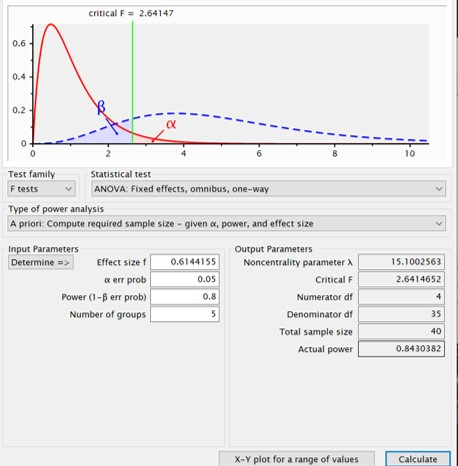

```{r setup, include=FALSE}
knitr::opts_chunk$set(echo = TRUE)
library(tidyverse)
library(ggplot2)
library(gtable)
library(gridExtra)
library(psych)
```

### 2.3 In your own words, describe what is meant by the terms (a) grand mean, (b) treatment effect,(c) error effect

#### (a)grand mean

在母群分配的期望值存在的情況下，grand mean指的是該分配的期望值，即:
$$Y\;\sim\;population\;distribution\\E[Y]=\mu$$而$\mu$為grand mean。 

#### (b)treatment effect

當$X$代表某一個treatment，而$Y$為依變項的隨機變數，treatment effect為$Y$在特定$x$下的conditional expectation和expectation的差異。即:
$$E[Y]=\mu\\E[Y|X=x_j]=\mu+\alpha_j\\E[Y|X=x_j]-E[Y]=\mu+\alpha_j-\mu=\alpha_j $$
則$\alpha_j$代表在$X=x_j$時的treatment effect。而這代表當我們控制實驗的操弄在$X=x_j$下，依變項$Y$和整體平均差異的期望值。

#### (c)error effect
代表的是在研究中未能被treatment effect解釋的部分。該部分可能包含受試者間的個體差異、實驗中測量的隨機誤差、受試者內的變異、其他未被控制的系統性誤差。一般而言，研究者通常會假設該誤差為$\mu=0,\sigma^2=\sigma^2_\epsilon$的常態分配。


### 2.9 The following data on running time (in seconds) in a straight-alley maze were obtained in a CRF-33 design.
```{r}
A=c("a1","a1","a1","a2","a2","a2","a3","a3","a3")
B=c("b1","b2","b3","b1","b2","b3","b1","b2","b3")
Y=c(9,8,5,7,7,5,6,5,5)
Data=data.frame(Y,A,B)
```

#### (a)Graph the interaction.

```{r}
ggplot(Data,aes(x=A,y=Y,color=B))+geom_line(aes(group=B))+geom_point(size=5)+
  labs(x="Magnitude of reinforcement",y="running time",color="Hours of deprivation")
ggplot(Data,aes(x=B,y=Y,color=A))+geom_line(aes(group=A))+geom_point(size=5)+
  labs(x="Hours of deprivation",y="running time",color = "Magnitude of reinforcement")

```


#### (b)Give a verbal description of the interaction.

從第二張圖來看，會發現Magnitude of reinforcement和Hours of deprivation間存在交互作用，而該交互作用是因為在不同的$b$下$a$的simple main effect 發生變化。而其中在$b_1$下$a$的simple main effect最大，在$b_2$下的次之，而在$b_3$下沒有simple main effect。因此若要下結論可能會說Hours of deprivation的增加會抑制a的效果

### 2.13 Distinguish among the following concepts.

#### (a) Sample distribution, population distribution, and sampling distribution

##### sample distribution

在抽樣後得到的該筆資料中不同樣本點的分布情形。

##### population distribution

代表的是研究中在意並進行抽樣的母群的分布情形。

##### sampling distribution

在抽樣後能得到一組隨機變數，而該組隨機變數的統計量的分配為sampling distribution。

#### (b)Sample statistic and test statistic

##### sample statistic

為樣本的函數，透過sample statistic我們能夠將樣本中多個樣本點的數值轉為單一數值，而該數值帶有部分樣本的資訊，例如:樣本平均數、全距。透過sample statistic我們能夠清楚的了解樣本的特性。


##### test statistic

同樣為樣本的函數，而在滿足特定前提下我們能知道該test statistic的分配。在進行hypothesis testing時，我們會對母群的參數進行假設並得到test statistic的分配，而根據假設檢定中的p-value，我們能衡量原本對母群的假設是否正確並做出推論。


### 2.16 Indicate the type of error or correct decision for each of the following.

#### a.A true null hypothesis was rejected.

$$P(H_0\;is\;rejected|H_0\; is\;true )=\alpha\; :type\;one\; error  $$

#### b.The researcher failed to reject a false null hypothesis.
$$P(fail\;to\;reject\;H_0|H_1\; is\;true )=\beta\; :type\;two\; error  $$

#### c.The null hypothesis is false and the researcher rejected it.
$$P(reject\;H_0|H_1\; is\;true )=1-\beta\; :power  $$

#### d.The researcher did not reject a true null hypothesis.

$$P(fail\;to\;reject\;H_0|H_0\; is\;true )=1-\alpha  $$

#### e.A false null hypothesis was rejected.

$$P(reject\;H_0|H_1\; is\;true )=1-\beta\; :power  $$

#### f.The researcher rejected the null hypothesis when he or she should have failed to reject it.

$$P(H_0\;is\;rejected|H_0\; is\;true )=\alpha\; :type\;one\; error  $$

### 2.21 What advantages do confidence interval procedures have over null hypothesis-testing procedures?

Confidence Interval 除了和NHST一樣能知道是否拒絕虛無假設外，還能夠提供母群參數估計值和標準誤等額外的資訊。

### 3.3 For each of the following chi-square variables, determine the mean and variance.

#### (a)

$$ if\;X \; \sim \;\Large \chi^2_v \; \normalsize then\\E[X]=v,Var[X]=2v \\thus\; E[\;\Large \chi^2_{20} \; \normalsize]=20 \;,Var[\;\Large \chi^2_{20} \; \normalsize]=40$$

### 3.15 Determine the degrees of freedom for SSTO, SSBG, and SSWG for the following CRp designs.
#### a.CR-3 with n = 10
$$df \;of\;SSTO=np-1=30-1=29\\
  df \;of\;SSBG=p-1=3-1=2\\
  df \;of\;SSWG=p(n-1)=3(10-1)=27\\
$$

#### b.CR-4 with n1 = 3, n2 = 4, n3 = 4, n4 = 5

$$df \;of\;SSTO=\sum\nolimits_{i=1}^5n_i \;-1=16-1=15\\
  df \;of\;SSBG=p-1=4-1=3\\
  df \;of\;SSWG=\sum\nolimits_{i=1}^5n_i-1=\sum\nolimits_{i=1}^5n_i\;-4=16-4=12
$$

#### 3.18 Explain why a test of$H_:\sigma^2_\alpha=0$ is a test of the hypothesis that $\alpha_1=\alpha_2=...=\alpha_p=0$.
By Kirk p.97 assumption c2,we know 
$$\alpha_j\;\; \underset {\LARGE\sim}{iid} \;\; \normalsize N(0,\sigma^2_\alpha) \;\;\forall j\in \{1,2...p\}\\
if \;\; Var[\alpha_j]=\sigma^2_\alpha=0,\;\;by\;Chebyshev \;inequality:\\
\Pr(|X-E[X] |\geq \epsilon )\leq {\frac {\sigma^2}{\epsilon^{2}}}\;\; \forall \;\;\epsilon>0.\\
\Pr(|\alpha_j-0 |\geq \epsilon )\leq {\frac {0}{\epsilon^{2}}}=0\;\; \forall \;\;\epsilon>0\;\;,\forall j\in \{1,2...p\},thus\\
\alpha_1=\alpha_2=...=\alpha_p=0
$$
因此可見在認為treatment effect的期望值為0時，假設$\sigma^2_{\alpha}=0$和假設$\alpha_1=\alpha_2=...=\alpha_p=0$是相同的。


### 3.21 Discuss the statement, “The F test is not appropriate for dichotomous data because such data depart radically from the normal distribution.

在Kirk p.99中提到即使是二分變項這樣違反常態分配前提的變項，過去的研究發現當n足夠大時仍能使用F-test。不過我認為n夠大的情形下，若樣本具有代表性則直接使用bootstrap來估計參數的信賴區間即可，不用拘泥於F-test也能作檢定。


### 4.5 
```{r}
a1=c(0,1,3,1,1,2,2,1,1,2)
a2=c(2,3,4,2,1,1,2,2,3,4)
a3=c(2,3,4,4,2,1,2,3,2,2)
a4=c(2,4,5,3,2,1,3,3,2,4)
a5=c(1,0,2,1,1,2,1,0,1,3)
order=rep(c(1:10),rep(5,10))
Dta=data.frame(a1,a2,a3,a4,a5)
Dta.long=pivot_longer(Dta,cols=c(a1,a2,a3,a4,a5),names_to = "learning")
Dta.long=mutate(Dta.long,order)
model1=lm(value~learning,Dta.long)
Aov=anova(model1)
model.st=rstandard(model1)
Dta.long=mutate(Dta.long,model.st)
```

#### a.Perform an exploratory data analysis on these data (see Table 4.2-1 and Figure 4.2-1). Assume that the observations within each treatment level are listed in the order in which the observations were obtained. Interpret the analysis.

```{r}

Dta  %>% describe( ) %>% .[,c(1:4)] %>% round(.,digit=2)

```

上表為各組的描述統計資料，能發現各組的樣本標準差差異不大，因此應該不違反變異數同質的假設。而各組的樣本平均數中能發現第二、三、四組的平均數相近而於第一、五組的平均數有較大的差距，因此各組的平均數可能不同。


```{r}

ggplot(Dta.long, aes(x=learning, y=value, color=learning)) + geom_boxplot()+  
  geom_jitter(position = position_jitter(width = 0.1, height = 0))

```


上圖為各組的盒鬚圖加上散佈圖，能發現各組資料除了第四組離散程度較大之外，離散程度大致相同。而能發現在每一組中都有部分資料落在盒鬚圖的虛線之外，因此可能需要檢查是否存在outlier。

```{r}

Dta.wide=pivot_wider(Dta.long,names_from=learning,values_from = value)
ggplot(Dta.long, aes(x=learning, y=model.st, fill=learning)) + 
  geom_dotplot(binaxis = "y", stackdir =  "up" )+
  labs(title="standardized residual plot",y="standardized residual")
```

上圖為所有受試者standardized residual的大小，能發現各組的residual 的離散程度並無明顯差異，因此各組間的變異應是相同的。此外，若根據Kirk於課本p.129提到的方法來檢查是否偏離常態，則能檢查standardized residual的分布是否有68.3%落於$\pm1$之間，而有95.4%的資料落於$\pm2$之間，有99.7%落於$\pm3$之間。能發現上面各組的standardized residual並無明顯違反常態的假設，此外各組中也沒有明顯的outlier。


```{r}

model.st=rstandard(model1)
Dta.long=mutate(Dta.long,model.st)
Dta.wide=pivot_wider(Dta.long,names_from=learning,values_from = value)
#應該要寫成loop的，但是我不知為何一直失敗QQ
  p1=ggplot(filter(Dta.long,learning=="a1"), aes(x=order, y=model.st))+
    labs(title="a1 standardized residual order plot ",y="standardized   residual")+
    geom_line()+
    geom_point() 
  p2=ggplot(filter(Dta.long,learning=="a2"), aes(x=order, y=model.st)) +
    labs(title="a2 standardized residual order plot ",y="standardized residual")+
    geom_line()+
    geom_point() 
  p3=ggplot(filter(Dta.long,learning=="a3"), aes(x=order, y=model.st)) +
    labs(title="a3 standardized residual order plot ",y="standardized residual")+
    geom_line()+
    geom_point() 
  p4=ggplot(filter(Dta.long,learning=="a4"), aes(x=order, y=model.st)) +
    labs(title="a4 standardized residual order plot ",y="standardized residual")+
     geom_line()+
    geom_point() 
  p5=ggplot(filter(Dta.long,learning=="a5"), aes(x=order, y=model.st)) +
    labs(title="a5 standardized residual order plot ",y="standardized residual")+
    geom_line()+
    geom_point() 

grid.arrange(p1,p2,p3,p4,p5,nrow=3)
```

上圖為各組standardized residual根據資料點的收集順序畫
出的散佈圖，能發現residual並沒有明顯的變化趨勢，因此實驗應該沒有因為資料的收集順序產生系統性誤差。


#### b.Test the null hypothesis μ1 = μ2 = … = μ5; let α = .05. Construct an ANOVA table and make a decision about the null hypothesis.

```{r}
print(Aov)
Fv=Aov$`F value`
pv=Aov$`Pr(>F)`

```
本次實驗的虛無假設為
$$H_0:\mu_1=\mu_2=...\mu_5$$各組間的平均數相同，並無treatment effect。對立假設為$$H_1:\mu_i\neq\mu_j \;for\;some \;i\;and\;j$$在$\alpha=0.05$下進行虛無假設檢定。檢定結果如上表所示，F-value(`r Fv[1]`)大於crtical value $F_{(4,45)}$(`r qf(0.95,4,45)`)，而p-value(`r pv[1]`)小於$\alpha(0.05)$。
故拒絕虛無假設，接受對立假設。這五組間的平均數並不相同。

#### c.Compute and interpret$\hat{\omega^2}$ and $\hat{f}$for these data.
```{r}
SSBG=Aov$`Sum Sq`[1]
SSWG=Aov$`Sum Sq`[2]
SSTO=SSBG+SSWG
MSWG=Aov$`Mean Sq`[2]
p=Aov$Df[1]
wsq=(SSBG-(p-1)*MSWG)/(SSTO+MSWG)
f=sqrt(wsq/(1-wsq))
```

根據課本p.135的公式$\hat{w^2}=\frac{SSBG-(p-1)MSWG}{SSTO+MSWG}$而$\hat{f}=\sqrt{\frac{\hat{\omega^2}}{1-\hat{\omega^2}}}$，因此$\hat{\omega^2}$=`r wsq`，而$\hat{f}$=`r f`

若根據Kirk p.143的中Cohen的判斷標準來看，則該研究的效果量屬於較大的效果量。


#### e.Use the results of part (b) as a pilot study and determine the number of subjects required to achieve a power of approximately .80.

\
\
\
在已知道效果量的情況下決定要收多少受試者才能使power>0.8，則根據G*Power的計算，所需的總受試者為40人。

#### f.Use Appendix Table E.12 to determine the number of subjects required to detect a medium association; let 1 – β = .80.

當$\omega^2=0.059$(medium association)，則$\phi=\sqrt{n}\sqrt{\frac{\omega^2}{1-\omega^2}}=\sqrt{n}\sqrt{\frac{0.059}{1-0.059}}=0.25\sqrt{n}$。若要達到power=0.8，則當$v_1$=4而$v_2$=45，$\phi=1.7$，故$1.7=0.25\sqrt{n}$，則$n=(6.8)^2=46.24$，則當每組受試者人數相同時，至少需要50人。

#### g.Determine the number of subjects required to achieve a power of .80, where the largest difference among means is 0.95σε.

若需要power達到0.8，當$v_1$=4而$v_2$=45，則根據Tang's Chart$\phi$為1.7左右。則當$d=0.95\sigma^2_\epsilon$時，$\phi=\sqrt{n}\sqrt{\frac{d^2}{2p}}=\sqrt{n}\sqrt{\frac{0.95^2}{10}}=0.3\sqrt{n}$。故當$\phi=0.3\sqrt{n}=1.7,n=32.11$，若要每組受試者人數相同，則至少要35位受試者。


```{r}
a1 <-c(11,12,19,13,17,15,17,14,13,16)
a2 <-c(11,14,10,9,12,13,10,8,14,11)
a3 <-c(7,18,16,11,9,10,13,14,12,12)
mean(a1+a2+a3)/3


```


