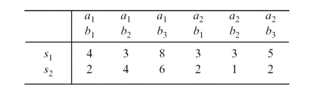
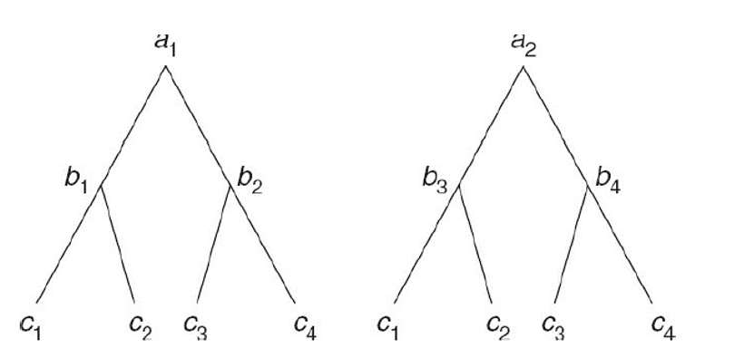

```{r setup, include=FALSE}
knitr::opts_chunk$set(echo = TRUE)
library(tidyverse)
library(ggplot2)
library(gtable)
library(gridExtra)
library(psych)
library(kableExtra)
library(ez)
```

# 8.2 Compare the randomization procedures for CR-p and RB-p designs
  RB-p 和 CR-p 二者皆是隨機指派，但差別在於 CR-p 是隨機指派實驗的最小單位(通常為受試者)於各種實驗情境下，每一個受試者只會接受一種實驗情境。而 RB-p 是每一個 block (8.25 中一個受試者為一個 block )以隨機的順序呈現所有實驗情境，所以每一個 block 會經歷所有實驗情境。


# 8.3 What are the four ways of forming homogeneous blocks in an RB-p design?
Kirk 8.1中提到的四種設定 blocks 的方式為:  

(1)  
將受試者依其在 nuisance variable 上的相似程度形成 blocks 。舉例而言，今天若要探討不同教學方式的成效，並以成績作為依變項。由於智力可能會是 nuisance variable，因此會將智力測驗分數相近的受試者組成一個 block 。  
(2)  以一個受試者作為一個 block，重複測量同一個受試者在不同實驗情境下的反應。  
(3)  將同卵雙胞胎或是異卵雙胞胎根據其在基因上的相似性組成一個 block 。  
(4)  將互相選擇的受試者如夫妻或是商業夥伴，考量到他們在測量變項上可能具有相似的表現，因此將其組成一個 block .

# 8.12 Following the procedure in Section 3.3 for a completely randomized design, derive the following E(MS)s for a randomized block design. Assume an additive model.
### a.E(MSA), E(MSBL), E(MSRES); assume that treatment A and blocks are fixed.

由於以上假設組效果與 blocks  皆是 fixed effect ，並且模型為可加成性模型( additive model )。因此根據Kirk 3.3提供的公式:  
$$E(MSA)=\sigma_{\epsilon}^2+\frac{n\sum\nolimits_{j=1}^{p}\alpha_{j}^2}{p-1}  \\
E(MSBL)=\sigma_{\epsilon}^2+\frac{p\sum\nolimits_{i=1}^{n}\pi_{i}^2}{n-1}  \\
E(MSRES)=\sigma_{\epsilon}^2$$
MSA的變異來源包含隨機誤差( error term )以及A的組效果。  
MSBL的變異來源包含隨機誤差以及blocks間的差異。  
MSRES變異來源包含隨機誤差。


### b.E(MSA), E(MSBL), E(MSRES); assume that treatment A is fixed but blocks are random.


由於以上假設組效果是 fixed effect ， blocks 是 random effect ，並且模型為可加成性模型( additive model )。因此根據Kirk 3.3提供的公式:  


$$E(MSA)=\sigma_{\epsilon}^2+\frac{n\sum\nolimits_{j=1}^{p}\alpha_{j}^2}{p-1}  \\
E(MSBL)=\sigma_{\epsilon}^2+p\sigma_{\pi}^2  \\
E(MSRES)=\sigma_{\epsilon}^2$$
MSA的變異來源包含隨機誤差( error term )以及A的組效果。  
MSBL的變異來源包含隨機誤差以及blocks間的差異。不過與( a )的差異在於blocks是 random effect ，而blocks的母群變異數為$\sigma_{\pi}^2$。  
MSRES變異來源包含隨機誤差。

# 8.16(a)Identify the type of matrix for the following


根據 Kirk 8.4，若共變異數矩陣的對角線元素相同，而非對角線元素也相同，則為S matrix。  
若滿足以下關係式，則為H matrix:  

$$\sigma_{Y_j}^2+\sigma_{Y_j'}^2-2\sigma_{Y_jY_j'}=a \;constant\; for\; all \;j\;ana\;j'\;(j\neq j')$$

(i)  
不滿足對角線元素相同且非對角線元素相同，但
$$\sigma_{Y_1}^2+\sigma_{Y_2}^2-2\sigma_{Y_1Y_2}=5+10-2.5\times2=10\\
\sigma_{Y_2}^2+\sigma_{Y_3}^2-2\sigma_{Y_2Y_3}=10+15-7.5\times2=10\\
\sigma_{Y_1}^2+\sigma_{Y_3}^2-2\sigma_{Y_1Y_3}=5+15-5\times2=10\\$$
故為H　matrix。  


(ii)  
對角線元素皆為6.1，且非對角線元素皆為3.4，故為 S matrix。

(iii)  
不滿足對角線元素相同且非對角線元素相同，但
$$\sigma_{Y_1}^2+\sigma_{Y_2}^2-2\sigma_{Y_1Y_2}=1+3-0.5\times2=3\\
\sigma_{Y_2}^2+\sigma_{Y_3}^2-2\sigma_{Y_2Y_3}=3+5-2.5\times2=3\\
\sigma_{Y_1}^2+\sigma_{Y_3}^2-2\sigma_{Y_1Y_3}=1+5-1.5\times2=3\\$$
故為H matrix。

# 9.3 List the treatment combinations for the following factorial designs.
(a) CRF22  
若將第一個treatment以a表示，第二個treatment以b表示則，所有treatment的組合為:

$$treatment \;combinations=\{\;a_1b_1,a_1b_2,a_2b_1,a_2b_2\;\}$$

(b) CRF23  
若將第一個treatment以a表示，第二個treatment以b表示則，所有treatment的組合為:

$$treatment \;combinations=\{\;a_1b_1,a_1b_2,a_1b_3,a_2b_1,a_2b_2,a_2b_3\;\}$$

(c) CRF33  
若將第一個treatment以a表示，第二個treatment以b表示則，所有treatment的組合為:

$$treatment \;combinations=\{\;a_1b_1,a_1b_2,a_1b_3,a_2b_1,a_2b_2,a_2b_3,a_3b_1,a_3b_2,a_3b_3\;\}$$

# 9.15 When does $\sum\nolimits_{i=1}^{p-1}SSB\hat{\Psi_{i(A)}}=\sum\nolimits_{j=1}^{pq1}SSA\hat{\Psi_{j(B)}}=SSAB?$

當contrast彼此互為正交時，treatment contrast interaction 的總和與 treatment treatment interaction 相同。  
因此要滿足以上關係的話，treatment A 的所有contrast 互為正交，且 treatment B 的所有 contrast 也互為正交。

# 9.17 Assume that the expected values of the mean squares for a design are as follows:


## Construct F′ and F″ statistics for testing treatment A.

根據課本p 405的公式，若要檢驗A 的組效果，則需要透過$E(MSA)、E(MSB w.A)、E(MSAC)、E(MSB w.A\times C)$來得到F'和F''，而F'和F''分別為:

$$F'=\frac{E(MSA)}{E(MSB w.A)+E(MSAC)-E(MSB w.A\times C)}\\F''=\frac{E(MSA)+E(MSB w.A\times C)}{E(MSB w.A)+E(MSAC)}$$

# 9.19 Assume that the following data have been obtained for a CRF-322 design (model II) with $n_{jkl}$ equal to 2:


(a) Perform preliminary tests on the model and pool where appropriate; write out the ANOVA table showing the values of mean squares and degrees of freedom.
```{r}
MSA=21.17
MSB=8.04
MSC=12.19
MSAB=1.6
MSAC=4.21
MSBC=7.85
MSABC=1.61
MSWCELL=1.56
F.abc=MSABC/MSWCELL
SSWCELL=MSWCELL*12
SSABC=MSABC*2
MSRES=(SSABC+SSWCELL)/14
SSAB=MSAB*2
F.ab=MSAB/MSRES
F.bc=MSBC/MSRES
F.ac=MSAC/MSRES
MSRES2=(SSAB+SSABC+SSWCELL)/16
```

接下來的檢定過程為了降低type II error，將設定$\alpha=0.05$。
先檢驗三皆的交互作用項是否達顯著。
虛無假設為:
$$H_0:\sigma^2_{\alpha\beta\gamma}=0$$
$$F=\frac{MSABC}{MSWCELL}=\frac{1.61}{1.56}$$
三階交互作用的F值為`r F.abc`，未達顯著值`r qf(0.75,2,12)`$F_{(0.25,2,12)}$，故保留虛無假設$H_0:\sigma^2_{\alpha\beta\gamma}=0$，不存在三階交互作用。將$MSWCELL、MSABC$進行合併，合併為$MSRES$，自由度為$df=3\times2\times2\times(2-1)+(3-1)(2-1)(2-1)=14$。

$$MSRES=\frac{SSABC+SSWCELL}{(3-1)(2-1)(2-1)+3\times2\times2\times(2-1)}$$

接下來檢視是否存在二階交互作用。
虛無假設分別為:
$$H_0:\sigma^2_{\alpha\beta}=0\\
H_0:\sigma^2_{\alpha\gamma}=0\\
H_0:\sigma^2_{\beta\gamma}=0\\$$

檢定的F值為:

$$F_{\alpha\beta}=\frac{MSAB}{MSRES}\;\;F_{\alpha\gamma}=\frac{MSAC}{MSRES}\;\;F_{\beta\gamma}=\frac{MSBC}{MSRES}$$
$F_{\alpha\beta}$為`r F.ab`小於顯著值`r qf(0.75,2,14)`($F_{0.25,2,14}$)，故保留虛無假設。而$F_{\alpha\gamma}$為`r F.ac`，大於顯著值`r qf(0.75,2,14)`($F_{0.25,2,14}$)。$F_{\beta\gamma}$為`r F.bc`，大於顯著值`r qf(0.75,1,14)`($F_{0.25,1,14}$)，故拒絕虛無假設。  
存在AC和BC的交互作用，但不存在AB的交互作用。合並先前的$MSRES、MSAB$

$$MSRES=\frac{SSWCELL+SSABC+SSAB}{(3-1)(2-1)(2-1)+3\times2\times2\times(2-1)+(3-1)(2-1)}$$
MSRES變為`r MSRES2`，自由度為16。

則最後的ANOVA table為:

```{r echo=FALSE}
df <- data.frame(source = c("MSA", "MSB","MSC","MSAC","MSBC","MSRES"),
                 df = (c(2,1,1,2,1,16)), 
                 value = (c(MSA,MSB,MSC,MSAC,MSBC,MSRES2)))

kable(df, col.names = c("Source", "df", "value"), escape = F) %>%
kable_styling(latex_options = "HOLD_position")
```


(b) Indicate the expected values of the mean squares for the final model.  
該模型的方程式為
$$Y_{ijkl}=\mu+\alpha_j+\beta_{k}+\gamma_l+(\alpha\gamma)_{jl}+(\beta\gamma)_{kl}+\epsilon_{i(jkl)}\\
i=1,2\;\;\;j=1,2,3\;\;\;k=1,2\;\;\;l=1,2\\
\mu:grand\;mean\\
\alpha_j:effect\;of\;treatment\;A\\
\beta_{k}:effect\;of\;treatment\;B\\
\gamma_l:effect\;of\;treatment\;C\\
(\alpha\gamma)_{jl}:effect\;of\;A\;C\;interaction\\
(\beta\gamma)_{kl}:effect\;of\;B\;C\;interaction\\
\epsilon_{i(jkl)}:error\;term
$$
其中A、B、C全是random effect。根據課本9.10的方式，能夠得到以下表格:
```{r echo=FALSE}
df2 <- data.frame(source = c("A", "B","C","AC","BC","RES"),
                 i = (c("n","n","n","n","n","1-n/N")),
                 j =(c("1-p/P","p","p","1-p/P","p","1")),
                 k = (c("q","1-q/Q","q","1-q/Q","1-q/Q","1")),
                 l =(c("r","r","1-r/R","1-r/R","1-r/R","1")),
                 EMS = c("$nqr\\sigma_{\\alpha}^2+nq\\sigma_{\\alpha\\gamma}^2+\\sigma_{\\epsilon}^2$",
                         "$npr\\sigma_{\\beta}^2+np\\sigma_{\\beta\\gamma}^2+\\sigma_{\\epsilon}^2$",
                         "$npq\\sigma_{\\gamma}^2+nq\\sigma_{\\alpha\\gamma}^2+np\\sigma_{\\beta\\gamma}^2+\\sigma_{\\epsilon}^2$",
                         "$nq\\sigma_{\\alpha\\gamma}^2+\\sigma_{\\epsilon}^2$",
                         "$np\\sigma_{\\beta\\gamma}^2+\\sigma_{\\epsilon}^2$",
                         "$\\sigma_{\\epsilon}^2$"
                         
                         
                         ))

kable(df2, col.names = c("Source", "i","j","k","l" ,"E(MS)"), escape = F) %>%

kable_styling(latex_options = "HOLD_position")

```
其中$n=2,p=3,q=2,r=2$。

(c) Construct an F′ statistic for testing treatment C.
根據以上表格，C組效果的F'為
$$F'=\frac{E(MSC)}{E(MSAC)+E(MSBC)-E(MSRES)}$$

F'的數值為`r MSC/(MSAC+MSBC-MSRES2)`

# 10.10 Suppose that the following data have been obtained for an RBF-23 design. Assume that the treatments are fixed effects and the blocks are random effects.

```{r message = FALSE}
treatment_A=rep(c(rep("a1",3),rep("a2",3)),2)
treatment_B=rep(rep(c("b1","b2","b3"),2),2)
measurement=c(4,3,8,3,3,5,2,4,6,2,1,2)
ID=as.factor(c(rep(1,6),rep(2,6)))
repdata=data.frame(measurement,ID,treatment_A,treatment_B)
Y=(sum(repdata$measurement))^2/(2*3*2)
ABS=sum(measurement^2)
S=(sum(repdata[ID=="1",]$measurement)^2+sum(repdata[ID=="2",]$measurement)^2)/(3*2)
A=sum(repdata[treatment_A=="a1",]$measurement)^2+sum(repdata[treatment_A=="a2",]$measurement)^2
A=A/(2*3)
B=sum(repdata[treatment_B=="b1",]$measurement)^2+sum(repdata[treatment_B=="b2",]$measurement)^2+sum(repdata[treatment_B=="b3",]$measurement)^2
B=B/(2*2)
N=repdata[ID=="1",]$measurement+repdata[ID=="2",]$measurement
AB=sum(N^2)/2
SSTO=ABS-Y
SSBL=S-Y
SSA=A-Y
SSB=B-Y
SSAB=AB-A-B+Y
SSRES=ABS-AB-S+Y
n=2
p=2
q=3
MSBL=SSBL/(n-1)
MSA=SSA/(p-1)
MSB=SSB/(q-1)
MSAB=SSAB/((p-1)*(q-1))
MSRES3=SSRES/((n-1)*(p*q-1))
F_A=MSA/MSRES3
F_B=MSB/MSRES3
F_AB=MSAB/MSRES3
F_BL=MSBL/MSRES3
s.Ybar=sqrt(MSRES3/4)
repdata <- repdata %>% group_by(treatment_B)
B.mean <- repdata %>% summarise(.,treat.mean=mean(measurement))
c1=c(1,-1,0)
c2=c(1,0,-1)
c3=c(0,1,-1)
FH12=sum(B.mean$treat.mean*c1)/s.Ybar
FH13=sum(B.mean$treat.mean*c2)/s.Ybar
FH23=sum(B.mean$treat.mean*c3)/s.Ybar
```

(a) Use the classical sum-of-squares approach to test the null hypotheses; let $\alpha$ =.05.  
在 $\alpha$ =.05下進行F檢定，其中虛無假設分別為:
$$ H_0:\mu_{.1.}=\mu_{.2.}$$
不存在A的組效果。
$$ H_0:\mu_{..1}=\mu_{..2}=\mu_{..3}$$
不存在B的組效果。
$$H_0:\sigma^2_{\pi}=0$$
不存在受試者間差異。
$$H_0:(\alpha\times\beta)_{jk}=0\;\;\;\forall\;\;j,k$$
不存在A和B的交互作用。  
計算後的到的結果中，A的組效果的F值為`r F_A`，大於臨界值`r qf(0.95,1,5)`($F_{(0.05,1,5)}$)，故拒絕虛無假設，認為存在A的組效果。
B的組效果的F值為`r F_B`，大於臨界值`r qf(0.95,1,6)`($F_{(0.05,1,6)}$)，故拒絕虛無假設，認為存在B的組效果。
BL的效果的F值為`r F_BL`，大於臨界值`r qf(0.95,1,5)`($F_{(0.05,1,5)}$)，故拒絕虛無假設，認為存在受試者間差異。
B和A的交互作用的F值為`r F_AB`，小於臨界值`r qf(0.95,1,6)`($F_{(0.05,1,6)}$)，故保留虛無假設，認為不存在A和B的交互作用。


(b) Use the Fisher-Hayter statistic to test all two-mean contrasts among the treatment B means. (Note:$\hat{\sigma}_{\bar{Y}}=\sqrt{\frac{MSRES}{np}}$ )  
根據提示，$\hat{\sigma}_{\bar{Y}}=\sqrt{\frac{MSRES}{np}}=\sqrt{\frac{0.95}{2\times2}}=$ `r sqrt(MSRES3/4)`。而根據課本公式:
$$qFH=\frac{\hat{\Psi}}{\hat{\sigma}_{\bar{Y}}}$$
在$\alpha=0.05$下，進行雙尾檢定，對組別的平均進行兩兩比較。虛無假設分別為:
$$ H_0:\mu_{..1}=\mu_{..2}$$
第一組與第二組平均無差異。
$$ H_0:\mu_{..1}=mu_{..3}$$
第一組與第三組平均無差異。
$$ H_0:mu_{..2}=\mu_{..3}$$
第二組與第三組平均無差異。  
檢定結果中，第一組與第二組平均比較的$qFH_{12}$為`r FH12`，第一組與第三組平均比較的$qFH_{13}$為`r FH13`第二組與第三組平均比較的$qFH_{23}$為`r FH23`。根據課本Table E.6，臨界值為3.64($qFH_{0.05,2,5}$)，$qFH_{12}$未達顯著，保留虛無假設，第一組平均與第二組平均無差異。$qFH_{13}$、$qFH_{23}$達顯著水準故拒絕虛無假設，第一組平均與第三組平均不同，第二組平均與第三組平均不同。


# 14.2 What is the principal advantage of a Latin square design over completely randomized and randomized block designs?

由於拉丁方格設計能夠排除兩個混淆變項(nuisance variable)，故相較於 completely randomized 和 randomized block designs在設計上更為有效。

# 14.3 Why is a Latin square design rarely used in behavioral and educational research?

由於拉丁方格設計假設不存在交互作用項，若存在交互作用項，則估計會存在偏誤。且該設計需要兩個nuisance variable的treatment level相同，在行為與教育研究上較為困難。

# 14.13 Suppose that the efficiency of a LS-4 design relative to that for a CR-4 design was found to be 1.35. Interpret this relative efficiency index.

該指標為1.35代表當實驗設計為CR-4而非LS-4時，所估計的 error variance 將膨脹為1.35倍。因此代表LS-4n我估計的 error variance 較小，較為有效。

# 11.7 Identify the following designs; assume in each case that the building block design is a CR-p design.


<div width=50%">

</div>


(a)  
C 的組效果巢套(nested)於 B 和 A 的組效果，而 B 的組效果巢套於 A 的組效果。故為 CRH-24(A)8(AB) design。

(b)  
A B C 的組效果互不巢套於彼此故為 CRF-222 design。  

(c)  
C 的組效果巢套(nested)於 A 的組效果，而 B 的組效果巢套於 A 的組效果。另外C(A)不巢套於B(A)，故為 CRPH-24(A)4(A) design。

(d)
與b相同，故為CRF-222 design。

(e)  
A 和 B 的組效果不巢套於彼此，而 C 的組效果巢套於 B 的組效果但不巢套於 A的組效果，為　CRPH-224(B) design。


(f)  
A 和 B 的組效果不巢套於彼此，而 C 的組效果巢套於 A 和 B 的組效果，為
CRPH-228(AB) design。

(g)  
圖中B的组效果和A的組效果為 completely crossed，而C的組效果巢套於A的組效果，而與A下B的組效果為completely crossed，故為CRPH 224(A) design。 

(h)  
A 和 B 和 C 為completely crossed，而D 巢套於C，為CRPH-2224(C) design。

(i)  
B巢套於A，C巢套於A 和 B，D巢套於 A和B和C，為CRH-24(A)8(AB)16(ABC) design


(j)  
B巢套於A，C巢套於A和B，而D與A、B、C為completely crossed。為CRPH-24(A)8(AB)2 design。

(k)  
B巢套於A，C巢套於A但與B(A)為completely crossed，D巢套於A但與B(A)和C(A)為completely crossed。為CRPH-24(A)4(A)4(A) design

(l)  
A B C 為completely crossed，而D巢套於A，但D(A)和B、C為completely crossed
，故為CRPH-2228(A) design。
(m)  
A和B為completely crossed，而C巢套於A和B，D巢套於A、B和C。故為
CRPH-228(AB)16(ABC) design。

# 11.8 Explain why the following is not a hierarchical design.



根據Kirk 的定義:  In a hierarchical design, the levels of at least one treatment are nested in those of another
treatment, and the remaining treatments are completely crossed.  

而 nested的定義為:If each level of, say, treatment
B appears with only one level of treatment A, B is said to be nested in A.

而在上圖的例子中 B 的組效果是巢套於A的組效果，而C的組效果和A的組效果為completely crossed 。但是C的組效果並不巢套於 B的組效果，例如 c1 就出現在 b1和 b3下，但是B和C也並非completely crossed。故不符合定義，不為階層性模型( hierarchical design)。

