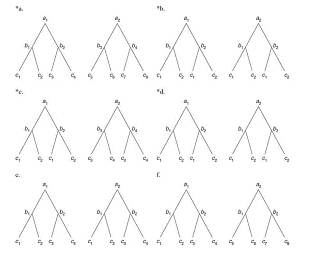
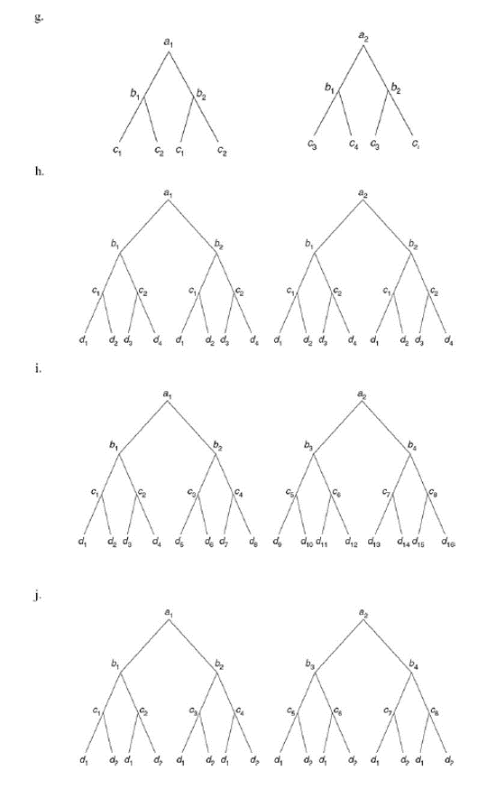
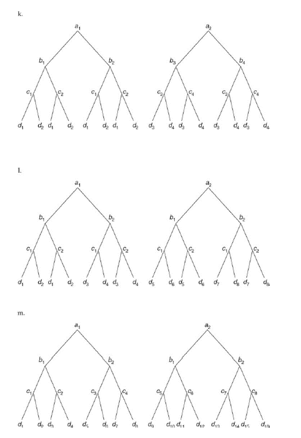
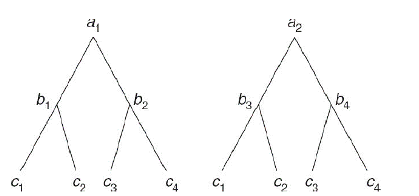

### 14.2 What is the principal advantage of a Latin square design over completely randomized and randomized block designs?

由於拉丁方格設計能夠排除兩個混淆變項(nuisance variable)，故相較於 completely randomized 和 randomized block designs在設計上更為有效。

### 14.3 Why is a Latin square design rarely used in behavioral and educational research?

由於拉丁方格設計假設不存在交互作用項，若存在交互作用項，則估計會存在偏誤。且該設計需要兩個nuisance variable的treatment level相同，在行為與教育研究上較為困難。

### 14.13 Suppose that the efficiency of a LS-4 design relative to that for a CR-4 design was found to be 1.35. Interpret this relative efficiency index.

該指標為1.35代表當實驗設計為CR-4而非LS-4時，所估計的 error variance 將膨脹為1.35倍。因此代表LS-4n我估計的 error variance 較小，較為有效。

### 11.7 Identify the following designs; assume in each case that the building block design is a CR-p design.

::: {width="50%\""}

:::

(a) C 的組效果巢套(nested)於 B 和 A 的組效果，而 B 的組效果巢套於 A 的組效果。故為 CRH-24(A)8(AB) design。

(b) A B C 的組效果互不巢套於彼此故為 CRF-222 design。

(c) C 的組效果巢套(nested)於 A 的組效果，而 B 的組效果巢套於 A 的組效果。另外C(A)不巢套於B(A)，故為 CRPH-24(A)4(A) design。

(d) 與b相同，故為CRF-222 design。

(e) A 和 B 的組效果不巢套於彼此，而 C 的組效果巢套於 B 的組效果但不巢套於 A的組效果，為　CRPH-224(B) design。

(f) A 和 B 的組效果不巢套於彼此，而 C 的組效果巢套於 A 和 B 的組效果，為 CRPH-228(AB) design。

(g) 圖中B的组效果和A的組效果為 completely crossed，而C的組效果巢套於A的組效果，而與A下B的組效果為completely crossed，故為CRPH 224(A) design。

(h) A 和 B 和 C 為completely crossed，而D 巢套於C，為CRPH-2224(C) design。

(i) B巢套於A，C巢套於A 和 B，D巢套於 A和B和C，為CRH-24(A)8(AB)16(ABC) design

(j) B巢套於A，C巢套於A和B，而D與A、B、C為completely crossed。為CRPH-24(A)8(AB)2 design。

(k) B巢套於A，C巢套於A但與B(A)為completely crossed，D巢套於A但與B(A)和C(A)為completely crossed。為CRPH-24(A)4(A)4(A) design

(l) A B C 為completely crossed，而D巢套於A，但D(A)和B、C為completely crossed ，故為CRPH-2228(A) design。

(m) A和B為completely crossed，而C巢套於A和B，D巢套於A、B和C。故為 CRPH-228(AB)16(ABC) design。

### 11.8 Explain why the following is not a hierarchical design.

根據Kirk 的定義: In a hierarchical design, the levels of at least one treatment are nested in those of another treatment, and the remaining treatments are completely crossed.

而 nested的定義為:If each level of, say, treatment B appears with only one level of treatment A, B is said to be nested in A.

而在上圖的例子中 B 的組效果是巢套於A的組效果，而C的組效果和A的組效果為completely crossed 。但是C的組效果並不巢套於 B的組效果，例如 c1 就出現在 b1和 b3下，但是B和C也並非completely crossed。故不符合定義，不為階層性模型( hierarchical design)。
